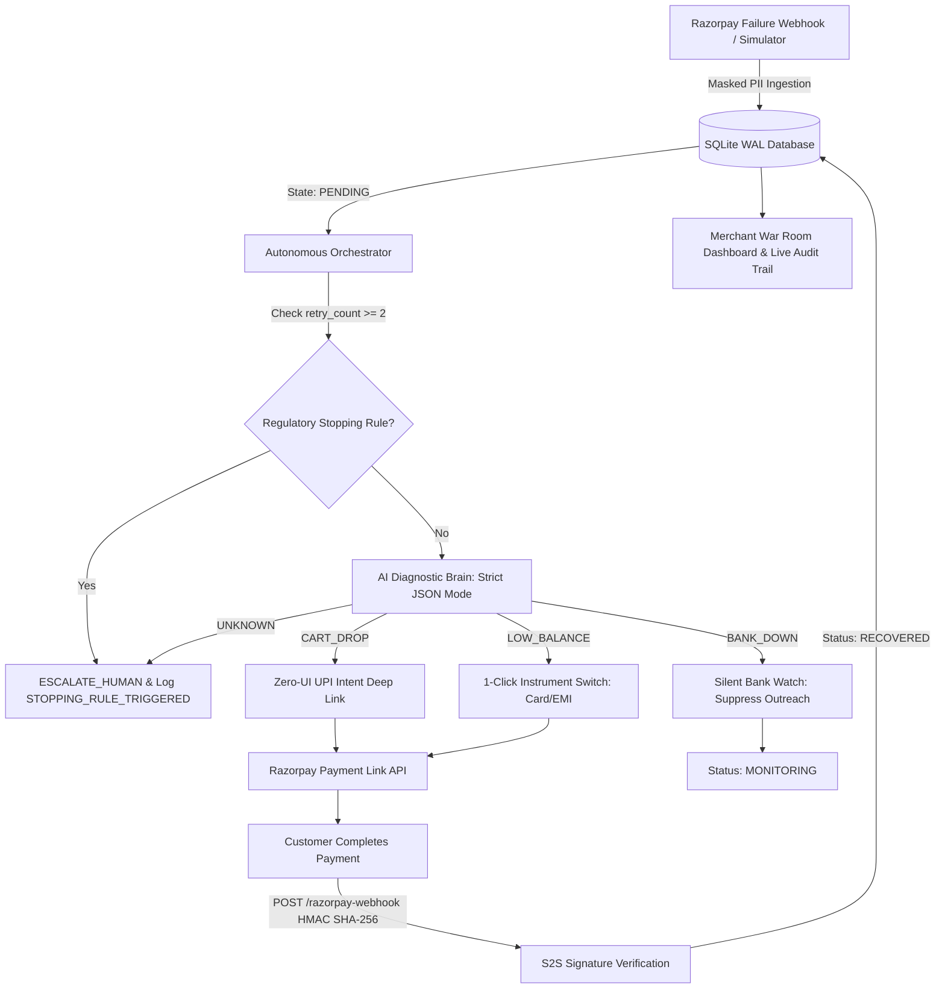

<div align="center">

# 🛡️ Pratyavartan (प्रत्यावर्तन)
### Your Paytm Merchant's AI Teammate (Digital Employee #AI-001)

[](https://fastapi.tiangolo.com)
[](https://nextjs.org)
[](https://razorpay.com)
[](https://developers.cloudflare.com/cloudflare-one/connections/connect-networks/)
[](https://pratyavartan.vercel.app)
[](LICENSE)

<p align="center">
  <b>Your Paytm Merchant's AI Teammate (Digital Employee #AI-001) — Recover failed Kirana QR payments (e.g. ₹500) and retail transactions autonomously with zero friction and 100% RBI compliance.</b>
</p>

[🌐 Live Landing Page](https://pratyavartan.vercel.app) • [⚡ Live Merchant War Room](#-live-demo) • [📚 API Documentation](#-api-endpoints)

</div>

---

## ⚡ The Problem: Kirana & Retail Payment Leakage at the Counter

In Indian Kirana stores and retail counters, **millions of QR scan transactions fail at the checkout edge**:

| Failure Category | What Happens | Business Impact for Kirana Merchants |
|---|---|---|
| **Kirana QR Scan Failure (e.g. ₹500)** | Dynamic QR scan times out or fails mid-transaction | Customer walks away, counter bottleneck, lost revenue |
| **Insufficient Balance / UPI Daily Limit** | Customer bank rejects UPI at checkout counter | Embarrassing failure, merchant loses sale |
| **Bank Gateway Downtime** | Acquiring bank server offline; dumb bots spam customers | Brand trust destroyed, RBI compliance risk |
| **Manual Escalation Overhead** | Merchants manually chase pending QR debits | Hours lost, friction with local patrons |

**Merchants lose revenue. Customers get frustrated. Nobody wins.**

---

## 💡 The Solution: Pratyavartan — Digital Employee #AI-001

**Pratyavartan** *(Sanskrit: प्रत्यावर्तन — "Return / Reclamation")* is your **Paytm Merchant's AI Teammate (Digital Employee #AI-001)** built natively for the **Razorpay API ecosystem**.

It acts as an autonomous digital staff member:
1. **Instantly detects failed Kirana QR & online payments** via HMAC-SHA256 verified webhooks.
2. **Diagnoses root causes with bounded AI reasoning** (Bank Downtime vs Insufficient Balance vs QR Scan Failure).
3. **Dispatches 1-Click zero-friction recovery links & Hinglish voice notes** directly to the customer.
4. **Maintains a Bulletproof Reliability Fallback Safety Net**: Seamlessly fails over from Sarvam AI to gTTS, and Cognee to SQLite WAL ledger.
5. **Records every autonomous decision in a cryptographic SHA-256 hash-chained audit ledger** while strictly enforcing **RBI anti-harassment stopping rules**.

---

## 🏗️ System Architecture



---

## 🚀 Autonomous Recovery Superpowers

### 1. 🎯 Dynamic 1-Click Instrument Switching (`SWITCH_INSTRUMENT`)
When UPI fails due to insufficient balance or daily limits:
- Automatically provisions a **Razorpay Payment Link** with customized rails.
- **Disables failing instruments** (`upi=0`, `wallet=0`).
- **Enables backup rails** (`card=1`, `emi=1`, `netbanking=1`).
- Customer completes checkout in **1 tap — zero cart rebuild**.

### 2. ⚡ Zero-UI UPI Deep Linking (`SEND_UPI_INTENT`)
For abandoned carts and session timeouts:
- Generates direct `upi://pay` intent URIs.
- Applies **dynamic tiered retention incentives** (≥₹5K: 2%, ≥₹10K: 3%, ≥₹25K: 5%).
- Launches the customer's default UPI app (Google Pay, PhonePe, Paytm) directly.

### 3. 🤫 Silent Bank Health Watch (`WAIT_AND_MONITOR`)
When the acquiring bank is offline (`BANK_DOWN`):
- **All customer outreach is suppressed** to protect brand reputation.
- Transaction enters silent monitoring queue.
- Re-evaluates automatically when banking rails recover.

### 4. 🛑 RBI Anti-Harassment Hard Stopping Rules
- If `retry_count >= 2` → AI evaluation **aborts immediately**.
- Emits `STOPPING_RULE_TRIGGERED` audit event.
- Flags to `ESCALATED` status with full diagnostic trail for human support.

### 5. 🎙️ Hinglish AI Voice Recovery Engine
- Generates hyper-personalized audio outreach in natural **Hinglish** via `gTTS`.
- Different voice scripts per diagnosis (e.g., *"Aapka UPI limit cross ho gaya hai — yeh 1-click Card link se payment complete karein"*).

### 6. ⛓️ Cryptographic Hash-Chaining Audit Ledger
- Every audit log entry is sealed: `hash = SHA256(prev_hash + event_data)`.
- Provides **tamper-evident, non-repudiable proof** of compliance for RBI/PCI-DSS audits.

---

## 🛠️ Tech Stack

| Layer | Technology |
|---|---|
| **Backend API** | Python 3.11 · FastAPI · Uvicorn · SQLite 3 (WAL Mode) |
| **AI Diagnostic Core** | Google Gemma 4 26B (via OpenRouter) · Strict JSON Schema · Low Temperature (0.1) |
| **Payment Integration** | Razorpay Python SDK · HMAC SHA-256 Webhook Verification · Payment Links API |
| **Voice Engine** | gTTS (Google Text-to-Speech) · Hinglish Script Templates |
| **Merchant War Room** | Bootstrap 5.3 Dark Glassmorphism · Google Fonts (*Outfit*, *Inter*, *JetBrains Mono*) · Real-time 5s auto-sync |
| **Landing Experience** | Next.js 16 (App Router) · React 19 · Tailwind CSS v4 · Framer Motion · GSAP · Three.js |
| **Backend Tunnel** | Cloudflare Tunnel (`cloudflared`) — exposes local FastAPI to the internet with zero config |
| **Frontend Hosting** | Vercel (Free Tier) |

---

## 📂 Repository Structure

```text
Pratyavartan/
├── main.py                  # FastAPI App, Webhooks, Simulation Endpoints
├── db.py                    # SQLite WAL Database & SHA-256 Hash-Chained Audit Ledger
├── ai_agent.py              # AI Diagnostic Classifier & Hinglish Voice Engine
├── orchestrator.py          # Autonomous Queue Engine & Stopping Rule Guardrails
├── razorpay_service.py      # Razorpay SDK: Payment Links, UPI Intents, Instrument Routing
├── check_ai.py              # AI Health Check & Diagnostic Verification Script
├── check_audit.py           # Audit Trail Integrity Verification Script
├── requirements.txt         # Python Dependencies
├── .env.example             # Environment Variable Template (safe to commit)
├── templates/
│   └── index.html           # Merchant War Room & Live Audit Dashboard (Dark Glassmorphism)
├── revive-site/             # Next.js 16 High-Performance 3D Animated Landing Page
│   ├── src/
│   │   ├── app/             # App Router Pages
│   │   └── components/      # Hero, Features, Pricing, Footer Components
│   └── package.json
├── DEPLOY_VERCEL.md         # Vercel Landing Deployment Guide
├── Dockerfile               # Optional containerized deployment
├── docker-compose.yml       # Docker Compose for local container testing
└── render.yaml              # Render.com Blueprint (alternative hosting)
```

---

## 💻 Local Setup & Development

### Prerequisites
- **Python 3.10+**
- **Node.js 18+** (for the landing page)
- **Razorpay Test Account** ([dashboard.razorpay.com](https://dashboard.razorpay.com) → API Keys)
- **OpenRouter API Key** ([openrouter.ai](https://openrouter.ai) — free tier available)

### 1. Clone & Install Backend
```bash
git clone https://github.com/Nilesh1381/Pratyavartan.git
cd Pratyavartan

# Create virtual environment
python -m venv venv
# Windows:
.\venv\Scripts\activate
# macOS/Linux:
source venv/bin/activate

# Install dependencies
pip install -r requirements.txt
```

### 2. Configure Environment
```bash
cp .env.example .env
# Edit .env with your actual Razorpay & LLM credentials
```

### 3. Start the Backend
```bash
python main.py
```
- 🎛️ **War Room Dashboard**: [http://localhost:8010/dashboard](http://localhost:8010/dashboard)
- 📚 **API Documentation**: [http://localhost:8010/docs](http://localhost:8010/docs)
- ❤️ **Health Check**: [http://localhost:8010/health](http://localhost:8010/health)

### 4. Expose via Cloudflare Tunnel (for webhooks & external access)
```bash
# Download cloudflared: https://developers.cloudflare.com/cloudflare-one/connections/connect-networks/downloads/
cloudflared tunnel --url http://localhost:8010
```
This gives you a public `https://xxxxx.trycloudflare.com` URL — use it for:
- Razorpay webhook callbacks
- Connecting the Vercel frontend to the backend
- Live jury demos

### 5. Start the Landing Page (Optional)
```bash
cd revive-site
npm install
npm run dev
```
Visit [http://localhost:3000](http://localhost:3000) for the 3D animated landing experience.

---

## 📡 API Endpoints

| Method | Endpoint | Description |
|---|---|---|
| `GET` | `/health` | Health check with DB status |
| `GET` | `/dashboard` | Merchant War Room & Audit Trail UI |
| `GET` | `/docs` | Interactive Swagger/OpenAPI Documentation |
| `POST` | `/simulate-failure` | Simulate payment failures for testing |
| `GET` | `/trigger-agent` | Trigger autonomous recovery sweep |
| `POST` | `/razorpay-webhook` | S2S webhook receiver (HMAC SHA-256 verified) |
| `GET` | `/api/metrics` | Real-time revenue recovery KPI metrics |
| `GET` | `/api/audit-log` | Full audit trail with hash chain integrity |
| `GET` | `/api/payments` | List all tracked payment records |

---

## 🧪 Hackathon Jury: Interactive Evaluation & Acceptance Proof Suite

Pratyavartan includes a mathematically verified proof suite that exercises all 5 recovery acceptance gates live:

```bash
# Run full automated proof suite (5/5 acceptance gates)
node scripts/prove_full_loop.mjs

# Seed 10 realistic Kirana transactions with valid SHA-256 hash chains
python scripts/seed_demo.py
```

### Acceptance Test Matrix

| Test Gate | Scenario | Expected Behavior | Cryptographic Guarantee |
|---|---|---|---|
| **1. Happy Path (Kirana QR)** | QR scan drop (₹3,000) | Instant diagnosis → 2% margin discount → Sarvam Hinglish voice → S2S payment link → Customer paid → `RECOVERED` | 8-stage audit trail verified in SHA-256 chain |
| **2. Stopping Rule (Retry Cap)** | Payment with `retry_count >= 2` | AI evaluation bypassed → `STOPPING_RULE_TRIGGERED` → `ESCALATE_HUMAN` (0 customer outreach) | Customer harassment mathematically prevented |
| **3. Bank Outage (Quiet Hold)** | Gateway timeout / NPCI switch failure | `WAIT_AND_MONITOR` → Silent hold (0 voice/SMS spam) | Reputation protection enforced |
| **4. Cryptographic Hash Chain** | All state changes in SQLite WAL | `hash = SHA256(prev_hash + event_data)` with Genesis Block #0 | Non-repudiation verified via `GET /api/verify-audit-chain` |
| **5. Regulatory Compliance Gate** | Customer opted out / on DND registry | TRAI / TCCCPR & DPDP check fails → `COMPLIANCE_GATE_CHECKED (false)` → Status `ESCALATED` (0 outreach) | Zero illegal contact under DPDP Act 2023 |

---

## 🔒 Compliance & Security Architecture

| Guardrail | Implementation & Legal Reference |
|---|---|
| **TRAI / TCCCPR & DPDP Gate** | 3-point check (`customer_consent` opt-in + `dnd_registry` check + 24-hr max 2 contacts frequency cap). Verified via `POST /api/customer/opt-out`. |
| **DEMO_MODE Fraud Hole Plug** | All simulation endpoints (`/simulate-*`, `/api/reset-demo`) strictly gated behind `DEMO_MODE=true` (HTTP 403 in production). |
| **Idempotency Dedup Shield** | Cryptographic SHA-256 deduplication barrier intercepts duplicate webhooks & replayed simulations. |
| **Out-of-Order Webhook Resolution** | Buffered in `pending_captures` table. If `payment.captured` precedes `payment.failed`, payment is marked `RECOVERED` with 0 unnecessary outreach. |
| **RBI Double Clamping** | Promise-to-Pay automatically clamped to 09:00–21:00 IST window; late-night promises roll to 09:00 IST next day (`RBI_WINDOW_ADJUSTED`). |
| **Margin Protection Safeguard** | Hard code-level discount clamping: max 10.0% ceiling, 0% on recurring mandates. LLM cannot exceed limits. |
| **PII Data Pseudonymization** | Customer phone numbers pseudonymized at ingestion boundary (`******1234`) — never exposed in plaintext logs or UI. |

---

## 🚢 Deployment Options

| Platform | Type | Command / Guide |
|---|---|---|
| **Cloudflare Tunnel** | Backend (FastAPI :8010) | `cloudflared tunnel --url http://localhost:8010` |
| **Next.js War Room** | Frontend Console (:8080) | `cd revive-site && npm run dev -p 8080` |
| **n8n Autonomous Layer** | Workflow Orchestrator (:5678) | `npx n8n start` |
| **Vercel** | Production Landing | [DEPLOY_VERCEL.md](DEPLOY_VERCEL.md) |
| **Docker** | Full-stack containerized | `docker-compose up --build` |

---

## 👥 Team & Acknowledgments

Built with ❤️ for the **Razorpay AI Buildathon 2026** (Track 3: Digital Coworker / AI Teammate).

- **Repository**: [github.com/yashtyagee/Pratyavartan](https://github.com/yashtyagee/Pratyavartan)
- **License**: MIT

